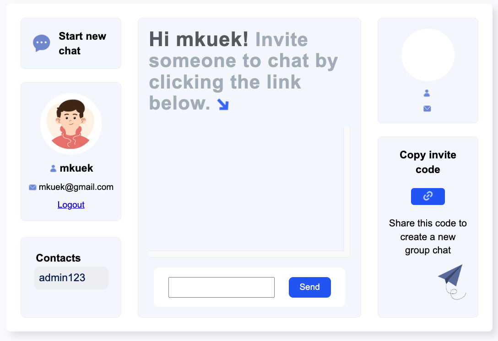
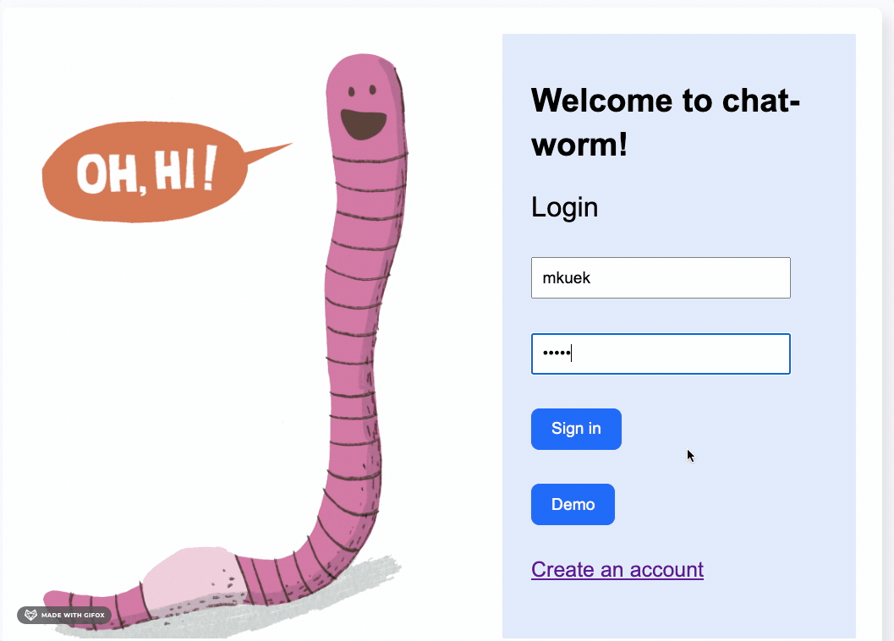
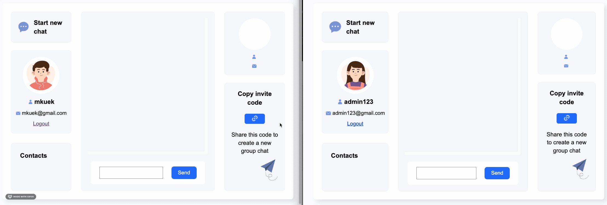
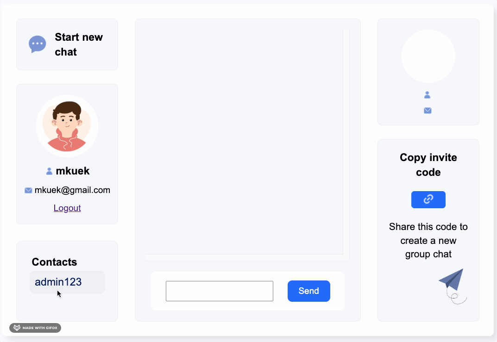
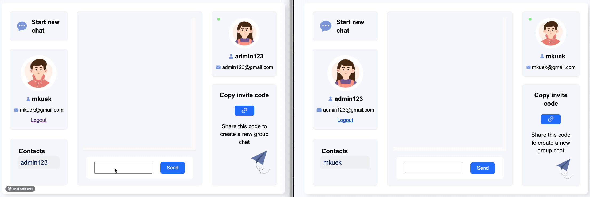

<!--
Hey, thanks for using the awesome-readme-template template.
If you have any enhancements, then fork this project and create a pull request
or just open an issue with the label "enhancement".

Don't forget to give this project a star for additional support ;)
Maybe you can mention me or this repo in the acknowledgements too
-->

<!--
This README is a slimmed down version of the original one.
Removed sections:
- Screenshots
- Running Test
- Deployment
- FAQ
- Acknowledgements
-->

<div align="center">

  <h1>Welcome to Chat-Worm!</h1>
  
  <p>
    This is a full stack messaging application. Intended audience is for several people seeking to establish contact with one another. Chat rooms can be established and are given a unique invitation code that can be distributed to interested members. Users can then join the room with the appropriate invitation code to establish the unique chat room. Information such as user information, chat history, and chat rooms are stored to a cloud based database. Chat history is preserved between sessions and are reestablished upon logging in.
  </p>
</div>
<!-- About the Project -->

## About the Project

<div align="center"> 
  
</div>

<!-- TechStack -->

### Tech Stack

<details>
  <summary>Client</summary>
  <ul>
    <li><a href="https://reactjs.org/">React.js</a></li>
    <li><a href="https://ejs.co/">EJS</a></li>
  </ul>
</details>

<details>
  <summary>Server</summary>
  <ul>
    <li><a href="https://www.typescriptlang.org/">Typescript</a></li>
    <li><a href="https://expressjs.com/">Express.js</a></li>
        <li><a href="https://www.passportjs.org/">PassportJS</a></li>
    <li><a href="https://axios-http.com/docs/api_intro">Axios API</a></li>
    <li><a href="https://socket.io/">SocketIO</a></li>
    <li><a href="https://nodejs.org/en/">Node JS</a></li>
  </ul>
</details>

<details>
<summary>Database</summary>
  <ul>
    <li><a href="https://www.mongodb.com/">MongoDB</a></li>
    <li><a href="https://mongoosejs.com/docs/documents.html">Mongoose JS</a></li>
  </ul>
</details>

<details>
<summary>DevOps</summary>
  <ul>
    <li><a href="https://www.heroku.com/">Heroku</a></li>
  </ul>
</details>

<!-- Features -->

### Features

- Real-time chatting between users with Socket.io
- Cloud-based database, MongoDB Atlas
- Messages, Users, and Chat room history stored and retreived between sessions
- User Authentication via PassportJS/Express-sessions
<!-- Prerequisites -->

### Run Locally

Clone the project

```bash
  git clone https://github.com/mkuek/full-stack-project.git
```

Go to the project directory

```bash
  cd full-stack-project
```

Install dependencies

```bash
  npm install
```

Start the server

```bash
  npm start
```

<!-- Usage -->

## Usage

Create new user or use Demo account to log into application


In order to demonstrate chat functionality, open a separate browser or a private broswer window. From there, another account can be signed into and chatting can begin.

Copy an invite code in the bottom right of the window using the button. Invite code can be pasted into another session or window to establish the chat room.


Established chat rooms are displayed in the lower left section of the page. Chat rooms can be joined by clicking on the indicated contact. Upon joining the room, the relavent information of the user someone is chatting with appears in the upper right section of the page.


Once the chat room is established, chatting between users can begin.


<!-- Contributing -->

## Contributing

<a href="https://github.com/mkuek/full-stack-project/graphs/contributors">
  
</a>

<!-- Code of Conduct -->

## License

Distributed under the no License. See LICENSE.txt for more information.

<!-- Acknowledgments -->

## Acknowledgements

- [Readme Template](https://github.com/othneildrew/Best-README-Template)
